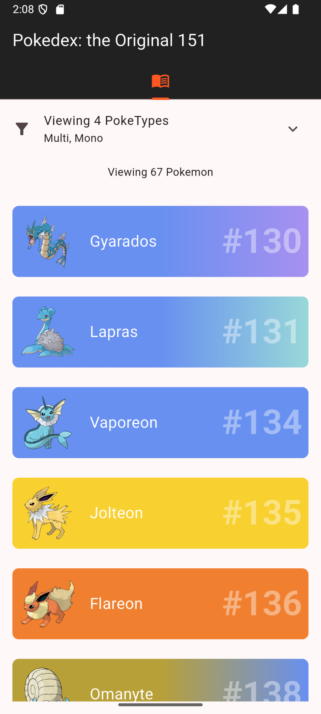

# Flutter Pokedex

A mobile Flutter app that integrates with a GraphQL API to display Pokemon. Built with `flutter_bloc` for 
state management.

# Getting Started

You can find the required Pokedex API here: https://github.com/Solenoden/GraphQL-Pokedex.BackEnd

Once you have it up and running, update the `API_BASE_URL` variable in the .env file to point
to the API.

If you are running the API locally, make sure to point to your IP address and include the port it is running on.
Do not use localhost as it refers to the mobile device.
